<!--
  ─────────────────────────────────────────────────────────────────────────────
  SETUP NOTES (delete this block once you're happy with it)

  1. The hero, terminal and divider graphics are hand-written animated SVGs
     living in ./assets/. They are self-hosted, so they never rate-limit,
     never 502, and no other profile on GitHub has them.

  2. The stat cards in section 03 are generated by
     .github/workflows/metrics.yml. Before the first run you must add a
     METRICS_TOKEN secret — the full steps are in the header comment of that
     workflow file. Then: Actions tab -> "Profile metrics" -> Run workflow.

  3. The contribution snake needs one run of .github/workflows/snake.yml
     (Actions tab -> "Generate contribution snake" -> Run workflow).
     It publishes to the `output` branch, which the <picture> block below
     reads from.

     Until 2 and 3 have run once, those images 404. Everything else — the
     animated SVGs, badges, skill icons, activity graph — works immediately.

  4. If a relative asset path ever fails to render, swap it for:
     https://raw.githubusercontent.com/marven250/marven250/main/assets/hero.svg
  ─────────────────────────────────────────────────────────────────────────────
-->

 

  
  
  

## `01` Who I am

<table>
<tr>
<td width="52%" valign="top">

I work at the seam where **IT operations, scripting, and documentation** meet — the
place where a problem is technically solved but practically still broken.

My bias is toward the **smallest reliable fix**: the script that removes a
recurring ticket, the runbook that makes an outage boring, the one-pager that
stops the same question from being asked five times.

Everything here is built in public. Some of it is polished, some of it is me
learning out loud. Both are on purpose.

 

**Currently**
`growing a public body of work, one project at a time`

**Open to**
`collaborations, and thoughtful technical conversations`

</td>
<td width="48%" valign="top" align="center">

</td>
</tr>
</table>

## `02` Toolkit

  

## `03` The numbers

<!-- Every card below is a static SVG generated by .github/workflows/metrics.yml
     and committed to metrics/. Nothing is fetched from a third-party server at
     page load, so nothing here can 503, 402, or rate-limit.

     metrics emits a fixed width with no viewBox, which GitHub then clips
     rather than scales. The workflow injects a matching viewBox after each
     render, which is what makes these percentage widths safe. -->

## `04` The commit story

<!-- Auto-generated daily by .github/workflows/snake.yml -->
<picture>
  <source media="(prefers-color-scheme: dark)" srcset="https://raw.githubusercontent.com/marven250/marven250/output/snake-dark.svg" />
  <source media="(prefers-color-scheme: light)" srcset="https://raw.githubusercontent.com/marven250/marven250/output/snake-light.svg" />
  
</picture>

  

<picture>
  <source media="(prefers-color-scheme: dark)" srcset="https://github-readme-activity-graph.vercel.app/graph?username=marven250&bg_color=0f172a&color=cbd5e1&line=38bdf8&point=f59e0b&area=true&area_color=1e3a8a&hide_border=true&custom_title=Contribution%20activity" />
  <source media="(prefers-color-scheme: light)" srcset="https://github-readme-activity-graph.vercel.app/graph?username=marven250&bg_color=ffffff&color=334155&line=1d4ed8&point=b45309&area=true&area_color=dbeafe&hide_border=true&custom_title=Contribution%20activity" />
  
</picture>

## `05` Under the hood

<b>&nbsp;What I'm digging into right now</b>

 

| | |
|---|---|
| **Automation** | Killing repetitive work before it becomes a habit — scheduled jobs, self-healing scripts, fewer human hands on the keyboard |
| **Foundations** | Going deeper on scripting, systems internals, and developer tooling instead of wider on frameworks |
| **Documentation** | Turning notes, dead ends, and post-mortems into things other people can use |
| **Restraint** | Finding the smallest reliable solution to the biggest practical problem |

<b>&nbsp;How this profile is built</b>

 

Most of what you're looking at is **hand-written animated SVG** living in
[`assets/`](assets/) — no JavaScript, no external fonts, pure
[SMIL](https://developer.mozilla.org/en-US/docs/Web/SVG/SVG_animation_with_SMIL)
and CSS embedded in the file. That means it renders anywhere GitHub renders an
image, it never rate-limits, and it doesn't look like every other profile.

| Piece | How |
|---|---|
| Hero banner | `assets/hero.svg` — drifting aurora gradients, orbital system, discrete-step typing animation, travelling sheen |
| Terminal card | `assets/terminal.svg` — simulated shell session on a 14s loop |
| Section rules | `assets/divider.svg` — glowing particles on a gradient line |
| Stat cards | [`lowlighter/metrics`](https://github.com/lowlighter/metrics) via a nightly Action, committed to `metrics/` |
| Snake graph | [`Platane/snk`](https://github.com/Platane/snk) via a scheduled Action, committed to the `output` branch |
| Theme switching | `<picture>` + `prefers-color-scheme` on the activity graph, so it follows your GitHub theme |

### One place to go

If you only click one thing —

 

